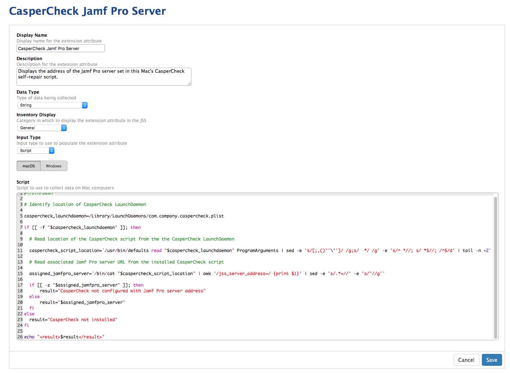

This Extension Attribute checks if the CasperCheck LaunchDaemon is installed, then uses the information in the LaunchDaemon and CasperCheck script to display the address of the Jamf Pro server set in this Mac's CasperCheck self-repair script.

If the defined LaunchDaemon is not installed, script returns the following:

**CasperCheck Not Installed**

If the defined LaunchDaemon is installed but the script is unable to determine the address of the Jamf Pro server, script returns the following:

**CasperCheck not configured with Jamf Pro server address**

If the defined LaunchDaemon is installed and the script is able to determine the address of the Jamf Pro server, the script returns the address of the Jamf Pro server (example shown below):

**jamf-pro.domain.com**

See below for a screenshot of how the Extension Attribute should be configured.

