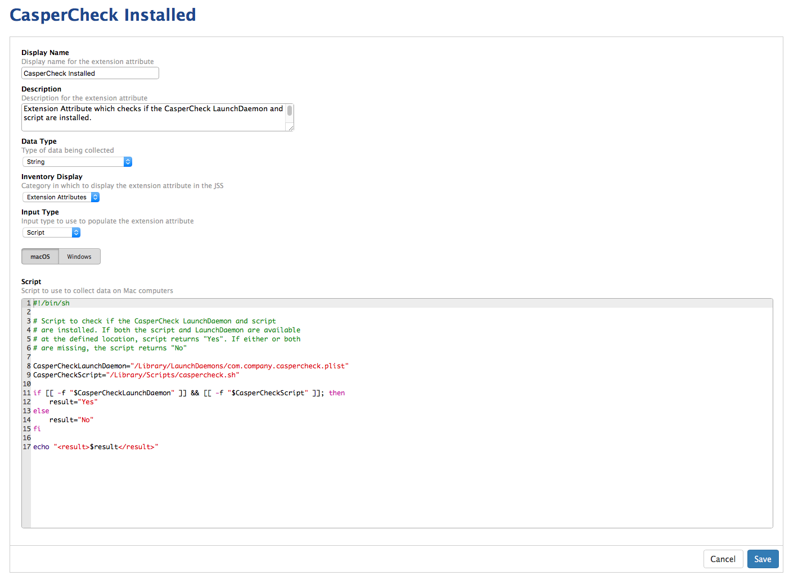

This Extension Attribute checks if the CasperCheck LaunchDaemon and script are installed. 

If both the script and LaunchDaemon are available at the defined location, script returns the following:

**Yes**

If either or both are missing, script returns the following:

**No**

See below for a screenshot of how the Extension Attribute should be configured.

