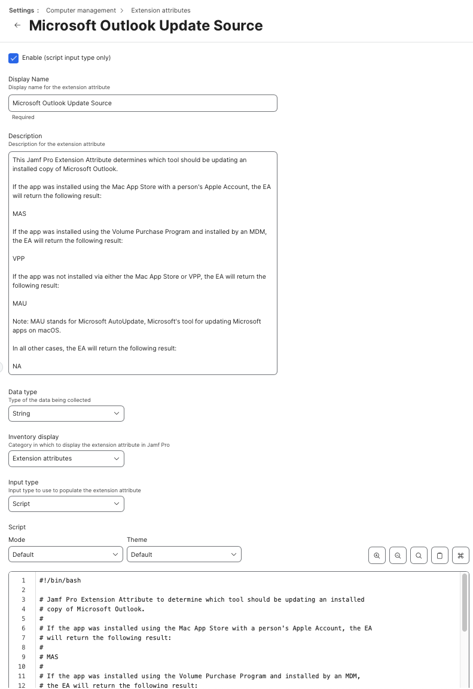

Jamf Pro Extension Attribute used to determine which tool should be updating an installed
copy of Microsoft Outlook.

If the app was installed using the Mac App Store with a person's Apple Account, the EA will return the following result:

`MAS`

If the app was licensed using the Volume Purchase Program and installed by an MDM, the EA will return the following result:

`VPP`

If the app was not installed via either the Mac App Store or VPP, the EA will return the following result:

`MAU`

**Note:** `MAU` stands for Microsoft AutoUpdate, Microsoft's tool for updating Microsoft apps on macOS.

In all other cases, the EA will return the following result:

`NA`

See `Jamf_Pro_Extension_Attribute_Setup.png` for a screenshot of how the Extension Attribute should be configured.

