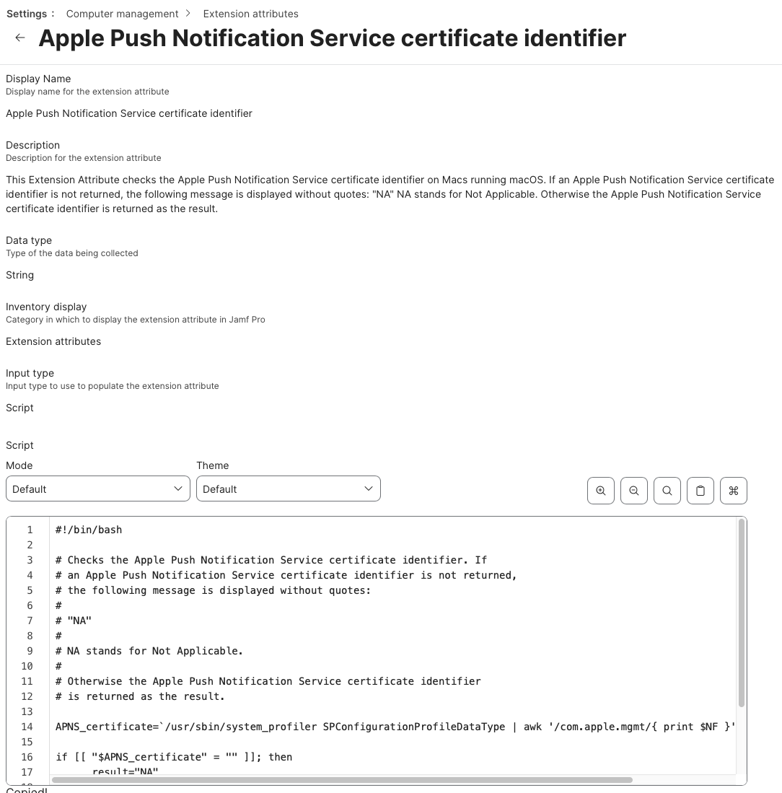

This Jamf Pro Extension Attribute checks the [Apple Push Notification Service](https://developer.apple.com/library/ios/documentation/NetworkingInternet/Conceptual/RemoteNotificationsPG/Chapters/ApplePushService.html) (APNS) certificate identifier on Macs running macOS. 

If an Apple Push Notification Service certificate identifier is not returned, the following message is displayed:

`NA`

`NA` stands for Not Applicable.

Otherwise the APNS certificate identifier is returned as the result.

See `Jamf_Pro_Extension_Attribute_Setup.png` for a screenshot of how the Extension Attribute should be configured.

