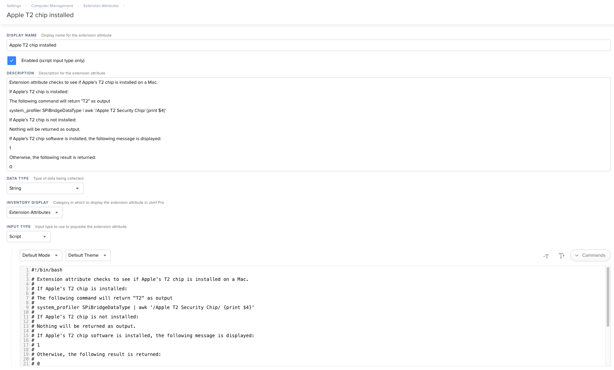

This Jamf Pro Extension Attribute checks to see if Apple's T2 chip is installed on a Mac. 

If Apple's T2 chip is installed:

The following command will return `T2` as output

`system_profiler SPiBridgeDataType | awk '/Apple T2 Security Chip/ {print $4}'`

If Apple's T2 chip is not installed:

Nothing will be returned as output.

If Apple's T2 chip software is installed, the following message is displayed:

`1`

Otherwise, the following result is returned:

`0`

See `Jamf_Pro_Extension_Attribute_Setup.png` for a screenshot of how the Extension Attribute should be configured.

