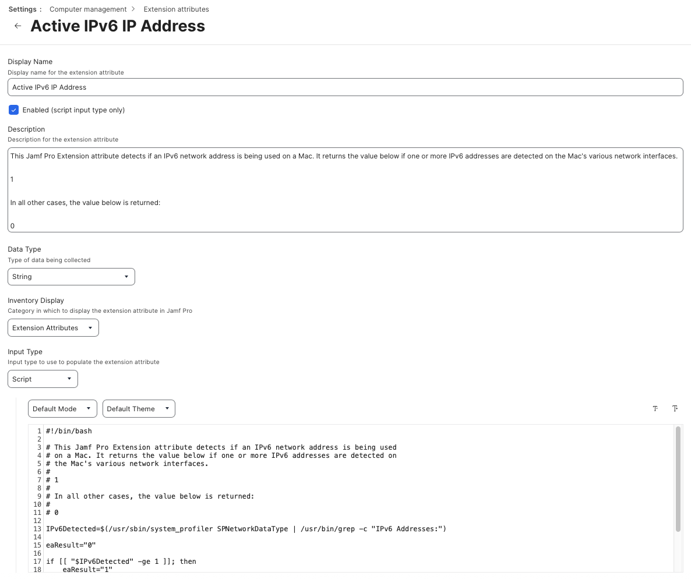

This Jamf Pro Extension attribute detects if an IPv6 network address is being used on a Mac. It returns the value below if one or more IPv6 addresses are detected on the Mac's various network interfaces.

`1`

In all other cases, the value below is returned:

`0`

See `Jamf_Pro_Extension_Attribute_Setup.png` for a screenshot of how the Extension Attribute should be configured.

