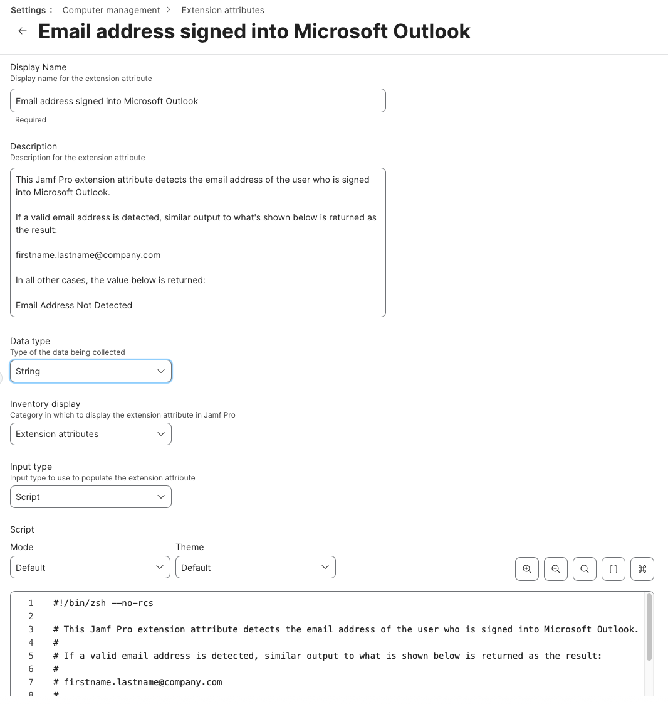

This Jamf Pro extension attribute detects the email address of the user who is signed into Microsoft Outlook.

If a valid email address is detected, similar output to what's shown below is returned as the result:

`firstname.lastname@company.com`

If no valid email address is detected, the following output is returned as the result:

In all other cases, the value below is returned:

`Email Address Not Detected`

See `Jamf_Pro_Extension_Attribute_Setup.png` for a screenshot of how the Extension Attribute should be configured.

