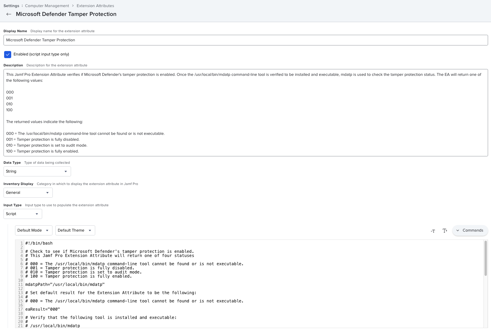

This Jamf Pro Extension Attribute verifies if Microsoft Defender's tamper protection is enabled. Once the `/usr/local/bin/mdatp` command line tool is verified to be installed and executable, `mdatp` is used to check the tamper protection status. The EA will return one of the following values:

* **000**
* **001**
* **010**
* **100**

The returned values indicate the following:

* **000** = The `/usr/local/bin/mdatp` command-line tool cannot be found or is not executable.
* **001** = Tamper protection is fully disabled.
* **010** = Tamper protection is set to audit mode.
* **100** = Tamper protection is fully enabled.

See below for a screenshot of how the Extension Attribute should be configured.

