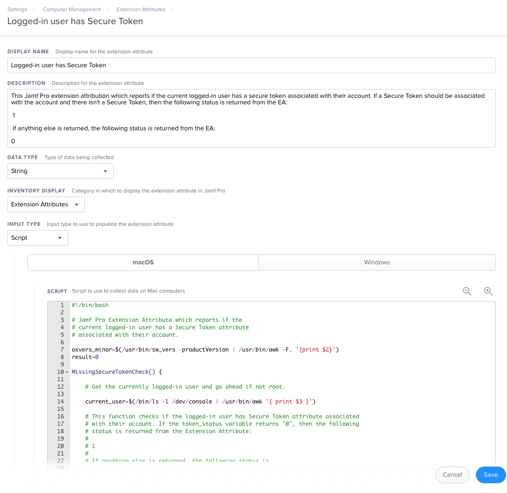

This Jamf Pro Extension Attribute is designed to report if the current logged-in user has a Secure Token attribute associated with their account. See `Jamf_Pro_Extension_Attribute_Setup.png` for a screenshot of how the Extension Attribute should be configured.

The Extension Attribute checks for the following:

1. If the Mac is running 10.13.x or later.
2. If the boot drive is using Apple File System (APFS) for its filesystem.
3. If FileVault is enabled or not.

If the Mac passes the following checks:

* Running 10.13.0 or later
* The boot drive is using APFS
* FileVault is enabled

Then the following actions take place:

1. The logged-in user is checked to see if it can be determined.
2. If the logged-in user can be determined and it is not the `root` user, the `sysadminctl` tool is used to check to see if the account has the Secure Token attribute associated with it.

Potential results of this extension attribute:

* 0 = Secure Token not enabled for the logged-in user on an encrypted APFS boot volume
* 1 = Secure Token enabled for the logged-in user on an encrypted APFS boot volume
* 2 = OS, filesystem or encryption checks returned as having one or more failed criteria
* 3 = Boot volume is not using APFS for its filesystem with FileVault is on
* 4 = Unable to determine the logged-in user or if the logged-in user is root
* 5 = Nothing changed the original "result" variable from the original value of "5" by the time the script finished its run.