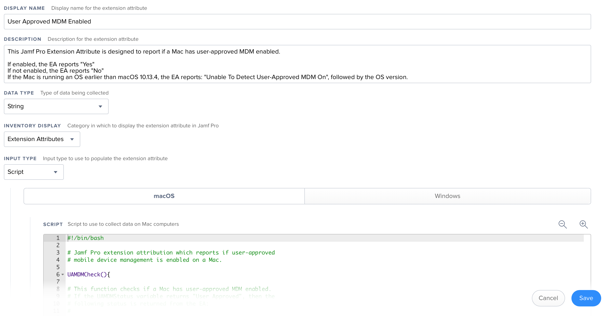

This Jamf Pro Extension Attribute is designed to report if a Mac has user-approved MDM enabled. See `Jamf_Pro_Extension_Attribute_Setup.png` for a screenshot of how the Extension Attribute should be configured.

The script first checks the OS on a particular Mac and verify that it's running macOS 10.13.4 or later. If the Mac is running an earlier OS, the script reports the following:

**Unable To Detect User-Approved MDM On**, followed by the OS version.

If the script verifies that it is running on macOS 10.13.4 or later, the script continues on to see if the Mac has user-approved MDM enabled.

If the Mac has user-approved MDM enabled, the script reports the following:

**Yes** 

If the Mac does not have user-approved MDM enabled, the script reports the following:

**No** 