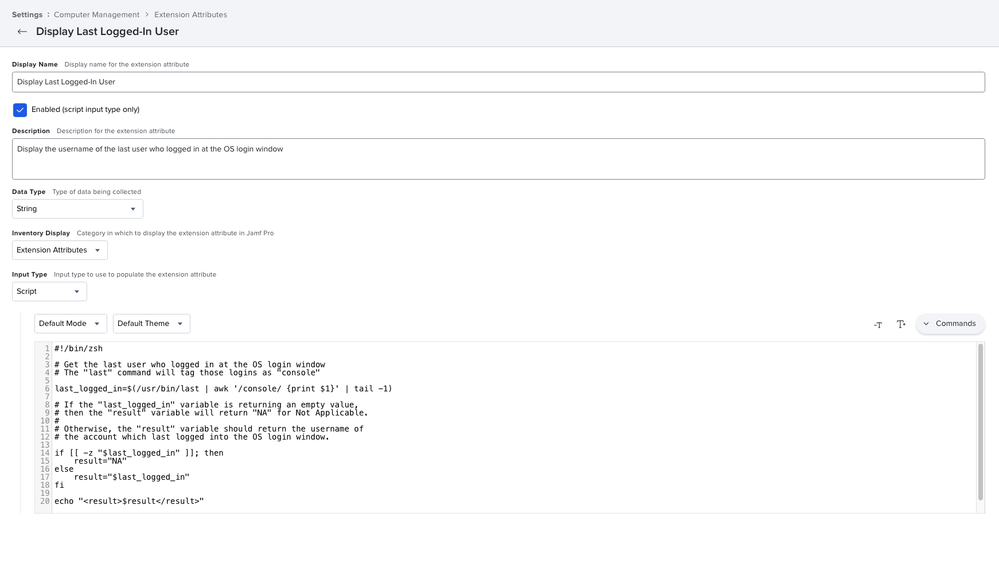

This Jamf Pro Extension Attribute is designed to display the username of the last user who logged in at the OS login window. See `Jamf_Pro_Extension_Attribute_Setup.png` for a screenshot of how the Extension Attribute should be configured.

If the `last_logged_in` variable is returning an empty value, then the `result` variable will return the following result:

`NA`

Otherwise, the `result` variable should return the username of the account which last logged into the OS login window.
