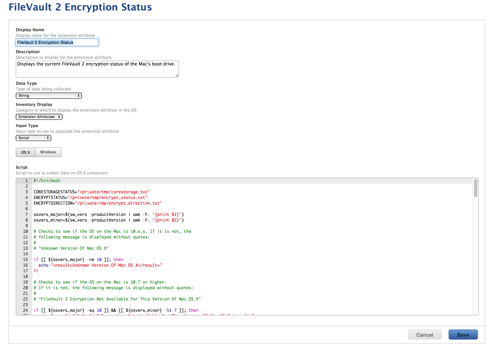

This Jamf Pro Extension Attribute is designed to check the FileVault 2 encryption status of Macs running Mac OS X 10.7.x and higher.

It first checks to make sure the version of macOS begins with "10". If it does not, the following message is displayed:

`Unknown Version Of Mac OS X`

Next, it checks to see if the OS on the Mac is 10.7 or higher. If it is not, the following message is displayed:

`FileVault 2 Encryption Not Available For This Version Of Mac OS X`

If the Mac is running 10.7 or higher, it checks whether the boot volume is APFS or CoreStorage. If it is neither, the following message is displayed:

`Unrecognized File System Personality`

If the Mac boot volume is APFS or CoreStorage, the Extension Attribute checks to see if the machine is encrypted, encrypting, or decrypting.

If not encrypted, the following message is displayed:

`FileVault 2 Encryption Not Enabled`

If encrypted, the following message is displayed:

`FileVault 2 Encryption Complete`

If encrypting, the following message is displayed:

`FileVault 2 Encryption Proceeding`

The message will also include the percentage of volume encryption (for APFS), or how much of the volume has been encrypted of the total amount of space (for CoreStorage).

If the amount of encryption is for some reason not known, the following message is displayed:

`FileVault 2 Encryption Status Unknown. Please check.`

If decrypting, the following message is displayed:

`FileVault 2 Decryption Proceeding`

The message will also include the percentage of volume decryption (for APFS), or how much of the volume has been decrypted of the total amount of space (for CoreStorage).

If fully decrypted (CoreStorage only), the following message is displayed:

`FileVault 2 Decryption Complete`

See the below screenshot for an example of how the Extension Attribute should be configured:

