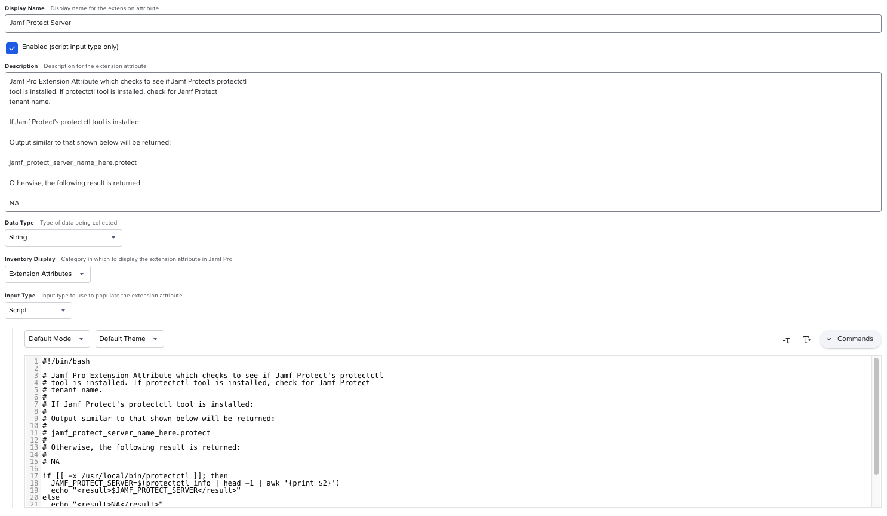

This Jamf Pro Extension Attribute checks to see if Jamf Protect's `protectctl`
tool is installed. If the `protectctl` tool is installed, check for the Jamf Protect
tenant name.

If Jamf Protect's `protectctl` tool is installed:

Output similar to that shown below will be returned:

`jamf_protect_server_name_here.protect`

Otherwise, the following result is returned:

`NA`

See `Jamf_Pro_Extension_Attribute_Setup.png` for a screenshot of how the Extension Attribute should be configured.

