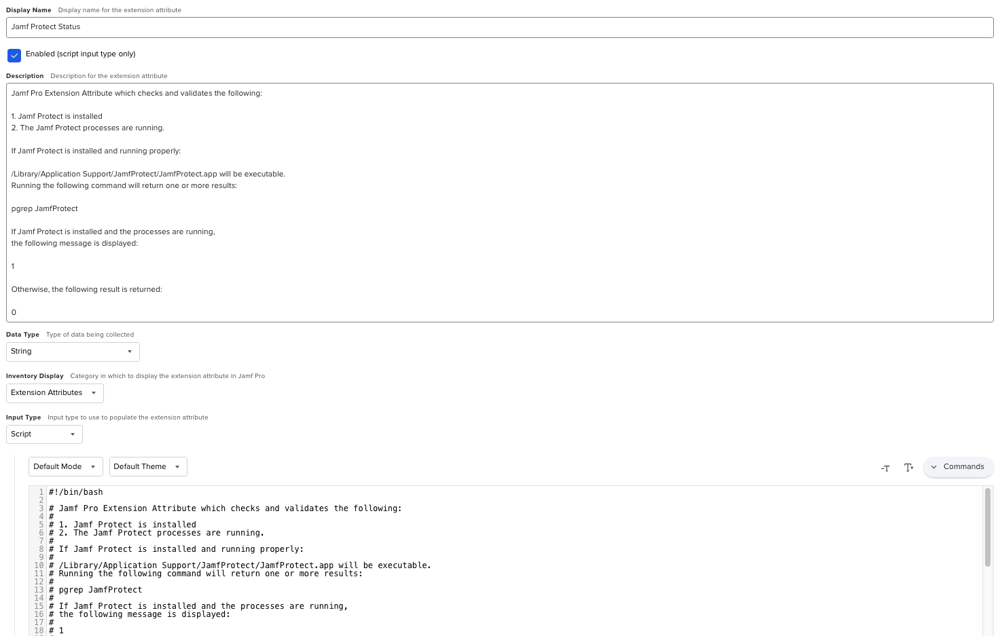

This Jamf Pro Extension Attribute which checks and validates the following:

* Jamf Protect is installed
* The Jamf Protect processes are running.

If Jamf Protect is installed and running properly:

`/Library/Application Support/JamfProtect/JamfProtect.app` will be executable.
Running the following command will return one or more results:

`pgrep JamfProtect`

If Jamf Protect is installed and the processes are running, 
the following message is displayed:

`1`

Otherwise, the following result is returned:

`0`

See `Jamf_Pro_Extension_Attribute_Setup.png` for a screenshot of how the Extension Attribute should be configured.

