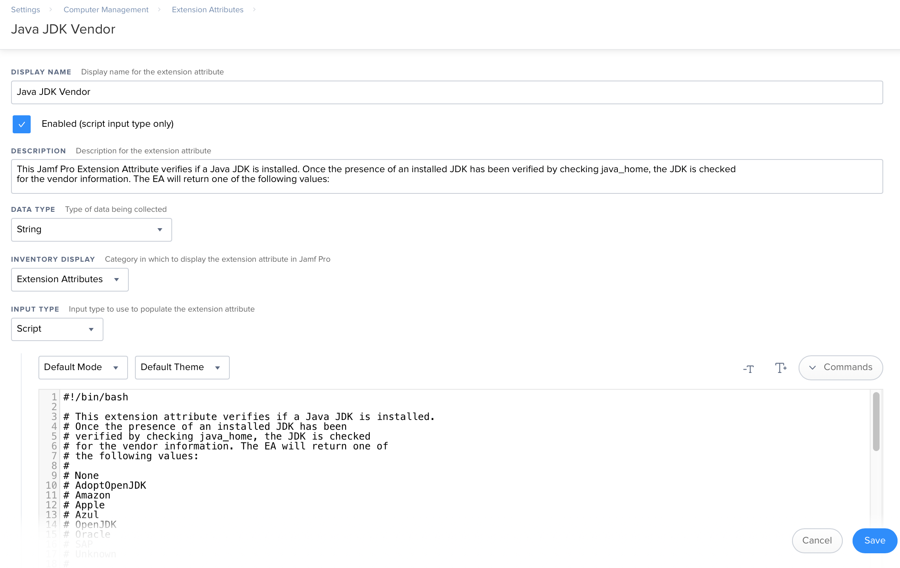

This Jamf Pro Extension Attribute verifies if a Java JDK is installed. Once the presence of an installed JDK has been verified by checking java_home, the JDK is checked for the vendor information. The EA will return one of the following values:

* `None`
* `AdoptOpenJDK`
* `Amazon`
* `Apple`
* `Azul`
* `OpenJDK`
* `Oracle`
* `SAP`
* `Unknown`

The returned values indicate the following:

* `None` = No Java JDK is installed.
* `AdoptOpenJDK` = [AdoptOpenJDK](https://adoptopenjdk.net) is the Java JDK vendor.
* `Amazon` = [Amazon](https://aws.amazon.com/corretto/) is the Java JDK vendor.
* `Apple` = [Apple](https://support.apple.com/downloads/java) is the Java JDK vendor.
* `Azul` = [Azul](https://www.azul.com/downloads/zulu-community) is the Java JDK vendor.
* `OpenJDK` = [OpenJDK](https://openjdk.java.net) is the Java JDK vendor.
* `Oracle` = [Oracle](https://www.java.com) is the Java JDK vendor.
* `SAP` = [SAP](https://sap.github.io/SapMachine/) is the Java JDK vendor.
* `Unknown` = There is a Java JDK installed, but it is not from one of the listed vendors.

See below for a screenshot of how the Extension Attribute should be configured.

