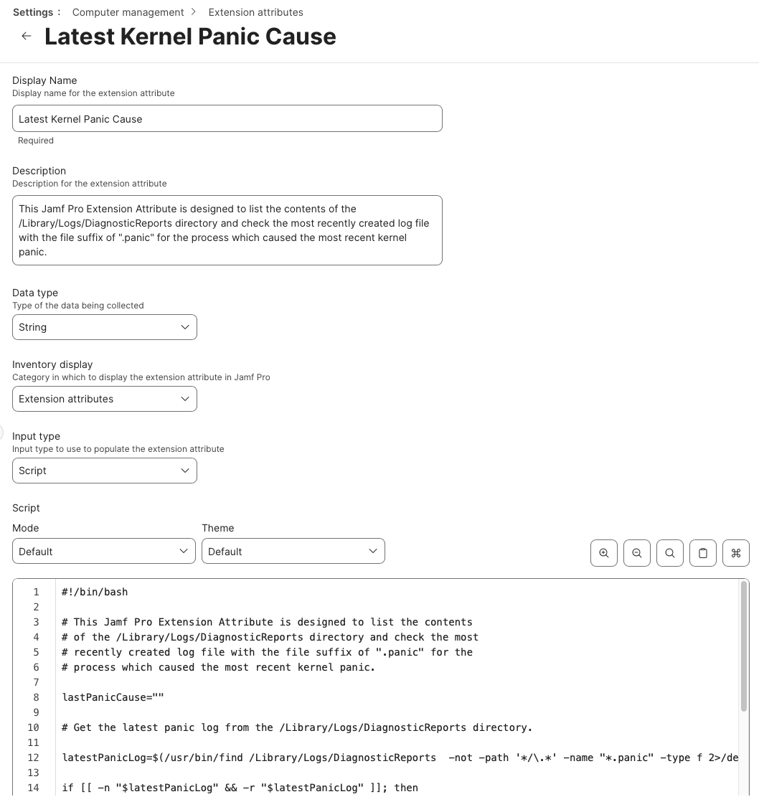

This Jamf Pro Extension Attribute is designed to list the contents of the `/Library/Logs/DiagnosticReports` directory and check the most recently created log file with the file suffix of `.panic` for the process which caused the most recent kernel panic.

See below for a screenshot of how the Extension Attribute should be configured.

