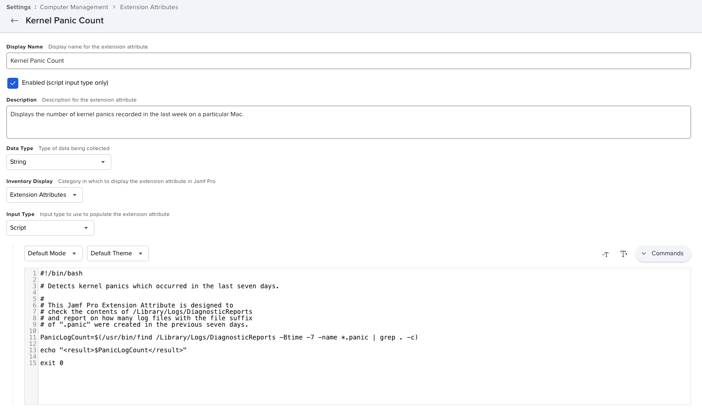

This Jamf Pro Extension Attribute is designed to check the contents of `/Library/Logs/DiagnosticReports` and report on how many log files with the file suffix of `.panic` were created in the previous seven days.

See below for a screenshot of how the Extension Attribute should be configured.

