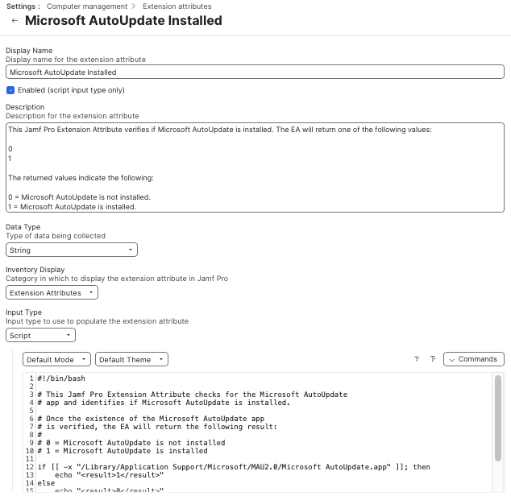

This Jamf Pro Extension Attribute verifies if Microsoft AutoUpdate is installed. The EA will return one of the following values:

* **0**
* **1**

The returned values indicate the following:

* **0** = Microsoft AutoUpdate is not installed.
* **1** = Microsoft AutoUpdate is installed.

See below for a screenshot of how the Extension Attribute should be configured.

