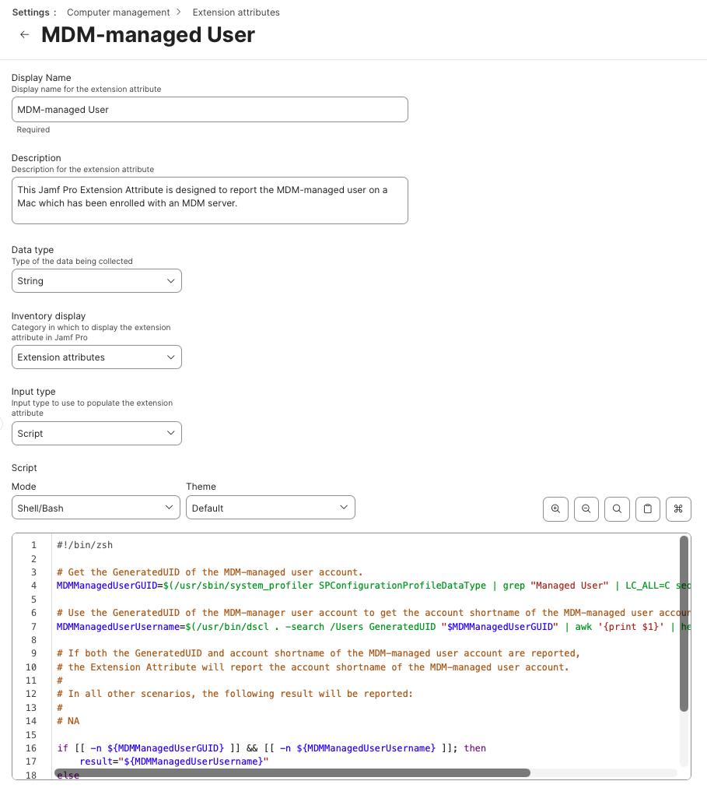

This Jamf Pro Extension Attribute is designed to report the MDM-managed user on a Mac which has been enrolled with an MDM server.

Please see `Jamf_Pro_Extension_Attribute_Setup.png` for a screenshot of how the Extension Attribute should be configured.

