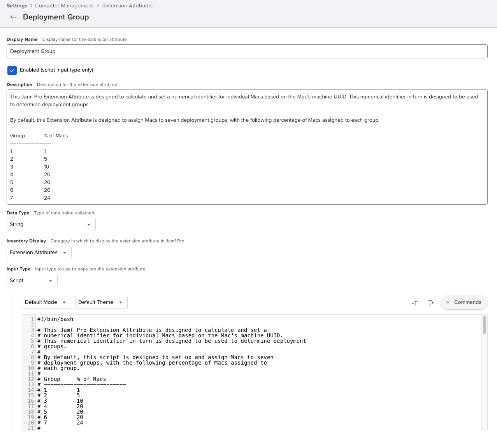

This Jamf Pro Extension Attribute is designed to calculate and set a numerical identifier for individual Macs based on the Mac's machine UUID. This numerical identifier in turn is designed to be used to determine deployment groups.

By default, this Extension Attribute is designed to assign Macs to seven deployment groups, with the following percentage of Macs assigned to each group.

|Deployment Group|Percentage of Macs|
|----------------|------------------|
|1               |1                 |
|2               |5                 |
|3               |10                |
|4               |20                |
|5               |20                |
|6               |20                |
|7               |24                |

When all is working correctly, the Extension Attribute will display one of the following values for each Mac:

|1  |
|---|
|2  |
|3  |
|4  |
|5  |
|6  |
|7  |

If there is a problem with assigning a specific Mac to a deployment group, the following value will be assigned by the Extension Attribute:

|0  |
|---|

See `Jamf_Pro_Extension_Attribute_Setup.png` for a screenshot of how the Extension Attribute should be configured.

