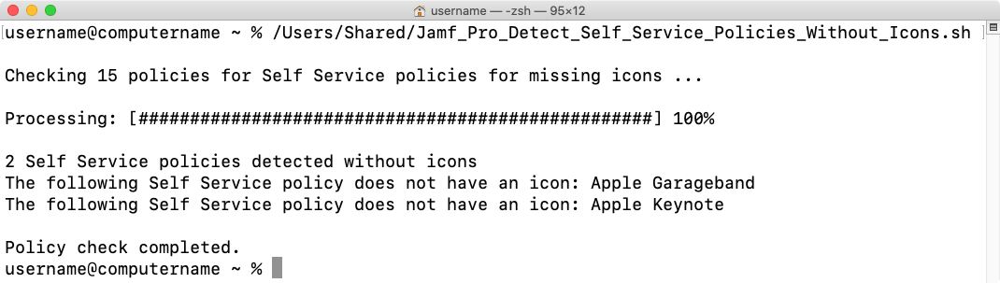

This script is designed to use the Jamf Pro API to identify Self Service policies that don't have icons.

If setting up a specific user account with limited rights, here are the required API privileges for the account on the Jamf Pro server:

**Jamf Pro Server Objects:**

* Policies: `Read`