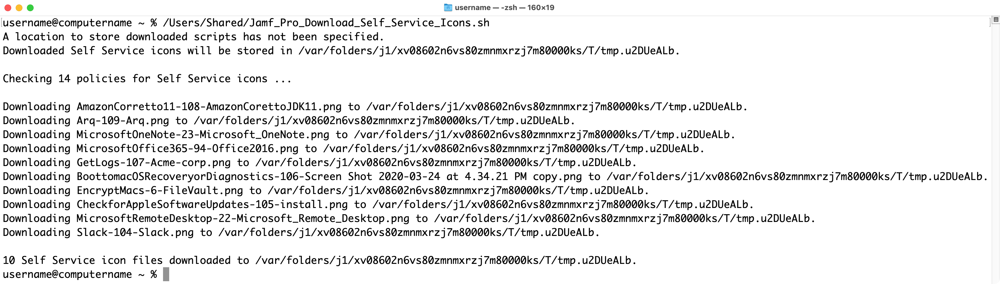

This script is designed to use the Jamf Pro Classic API to detect which Self Service policies have icons and downloads the icon graphic files to a download directory.

If setting up a specific user account with limited rights, here are the required API privileges for the account on the Jamf Pro server:

**Jamf Pro Server Objects:**

* Policies: `Read`