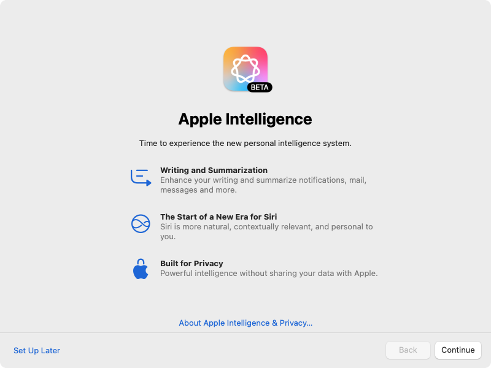

Apple is using `~/Library/Preferences/com.apple.SetupAssistant.plist` to store the setting that indicate whether or not the Apple Intelligence screen has been seen. Since having this screen appear may not be desirable in all Mac environments, this script suppresses the Apple Intelligence pop-up window for the logged-in user on a particular Mac running macOS 15.0.0 and later.

The script performs the following actions:

* Identifies if the Mac is running macOS 15 or later.
* Identifies if there is a logged-in user.
* If there is a logged-in user, gets the home folder and UID of the logged-in user.
* Sets the Apple Intelligence pop-up window setting to be disabled for the logged-in user.
* If there is not a logged-in user, the script exits with an error.
* If the Mac is not running running macOS 15 or later, the script exits with an error.

