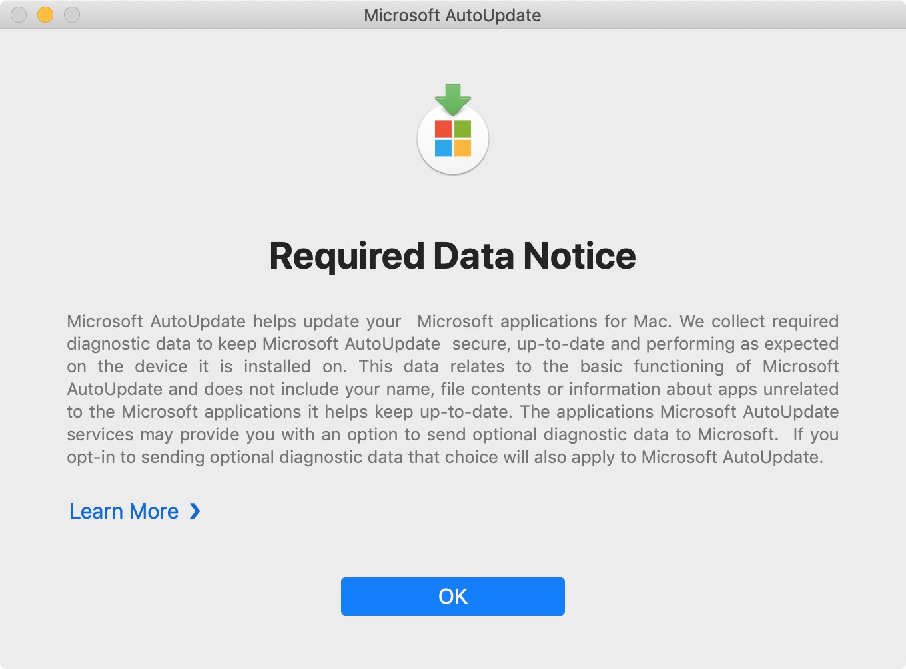

This script is designed to suppress the Microsoft AutoUpdate **Required Data Notice** screen.

The script runs the following actions:

1. Identifies all users on the Mac with a UID greater than 500
2. Identifies the home folder location of all users identified
   in the previous step.
3. Sets the `com.microsoft.autoupdate2.plist` file with the following
   key and value. This will suppress Microsoft AutoUpdate's 
   **Required Data Notice** screen and stop it from appearing.

   `Key: AcknowledgedDataCollectionPolicy`
   
   `Value: RequiredDataOnly`