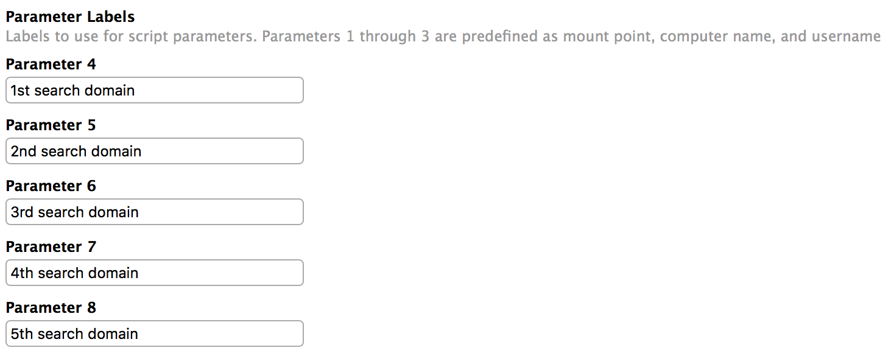
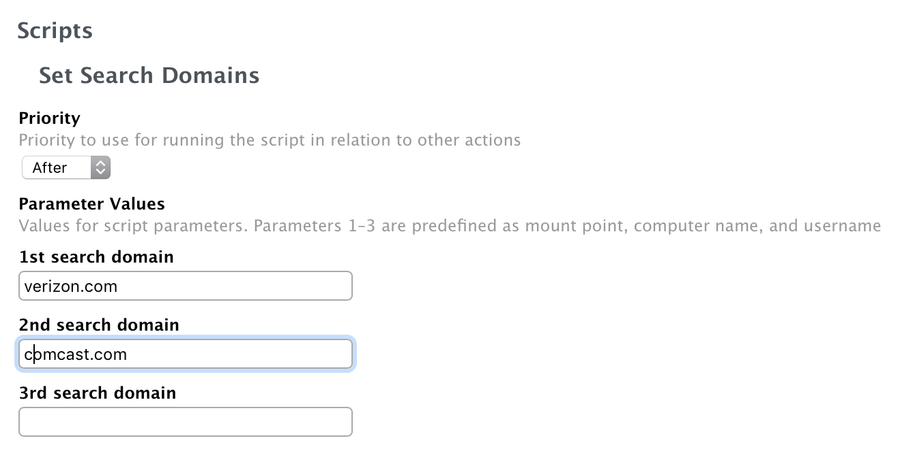

This script will set specified DNS search domains on a Mac's ethernet and Wi-Fi interfaces.

How the script works:

1. The script scans for and registers any network hardware that has not already registered.
2. All detected Ethernet and Wi-Fi interface names are read into an array
3. The script loops through the list of Ethernet and Wi-Fi network interfaces available on this Mac and sets the specified DNS search domains on each Ethernet network interface.

## Search Domains

Search Domains can be passed by Jamf Pro (up to six search domains). If parameters are empty, the script will fall back on the `SearchDomains` variable.

For the **SearchDomains** variable, change the search domains to be the ones you need and separate the search domains from each other by using spaces. For example, if you needed to set **verizon.com** and **comcast.com** as DNS search domains on Ethernet interfaces, the **SearchDomains** variable would be set like this:

`SearchDomains="verizon.com comcast.com"`

Note: The search list is currently limited to six domains with a total of 256 characters. ([resolver(5)](x-man-page://5/resolver))

## Jamf Pro

In Jamf, add the script as usual and set the Parameters accordingly. As resolver supports up to 6 search domains, it's a good idea to populate the first six parameters. Others will be ignored.

Script:

Policy:

## Caveats

- **User may rename an interface**: If user renames Wi-Fi to "Wireless", the script won't pick it anymore. You may want to hide the Network Preference Pane with a configuration profile
- **Search Domain list cannot be overriden by DHCP**: this is what we usually want, but some home services set the search domain and expect it to be present.
